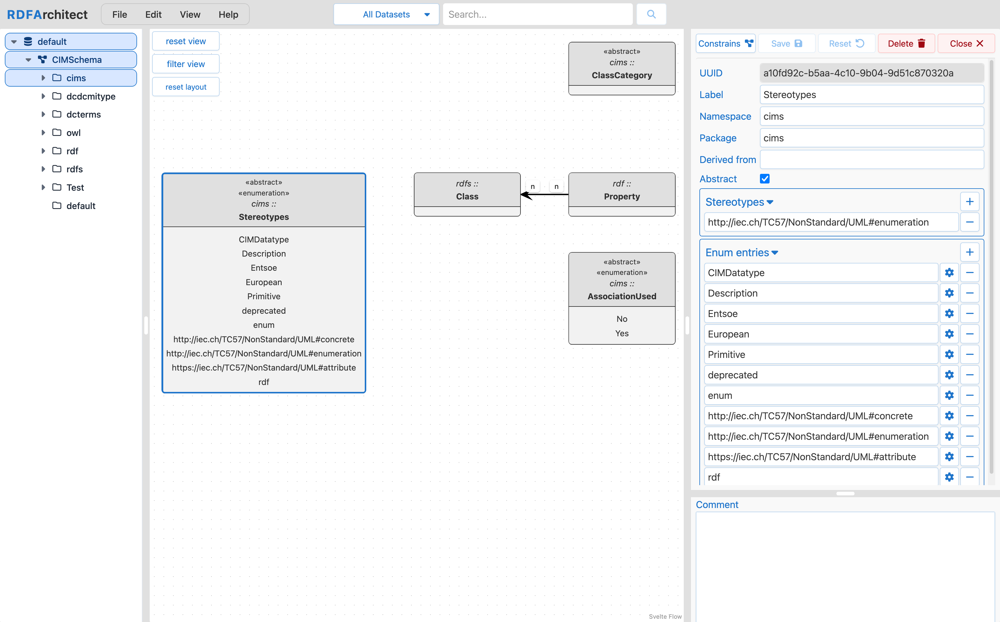

# RDFArchitect

[](https://github.com/SOPTIM/RDFArchitect/actions/workflows/backend-ci.yml)
[](https://github.com/SOPTIM/RDFArchitect/actions/workflows/frontend-ci.yml)
[](https://github.com/SOPTIM/RDFArchitect/releases)
[](LICENSE)

RDFArchitect is a web-based tool for visualizing, editing, and sharing RDFS schemas with CIM extensions - as used in CGMES and the ENTSO-e network code profiles — along with their SHACL constraints.

It is an open source alternative to proprietary CIM/RDF modeling tools.

## Overview

RDFArchitect combines a Java/Spring backend and a Svelte frontend to provide a practical modeling workflow for CIM-based RDF schemas. The application supports importing, editing, sharing, comparing, validating, and exporting schemas with an interactive UI.

Diagrams can be easily shared as a complete, browsable reference of classes, relations, attributes, enumerations, notes, and SHACL shapes - no modeling tool or download required.

## Screenshots

The main editor combines schema navigation, package-focused diagram rendering, and context-sensitive actions for importing, versioning, and validation.

Class editing stays close to the model: labels, packages, inheritance, attributes, associations, enum entries, comments, and class-specific SHACL constraints are all available from the same workspace.

RDFArchitect also supports release workflows such as schema comparison, change review, and SHACL inspection without leaving the application.



For the complete documentation, see the [docs site](https://rdfarchitect.soptim.de/).

## Key Features

- Import and export RDF schemas and CIM extensions
- Visualize class structures via UML diagrams
- Edit classes, attributes, associations, enum entries, and notes
- Share diagrams as a complete, read-friendly reference of classes, relations, notes, and constraints
- Schema migration between CIM versions and extensions
- Compare schemas and inspect change history
- Comprehensive SHACL support:
  - Generate SHACL rules covering everything in the schema
  - Import and manage custom SHACL shapes
  - Inspect shapes in context - directly on their target classes and properties

## Architecture

- Backend: Spring Boot service in `backend/` (default runtime port `8080`)
- Frontend: SvelteKit app in `frontend/` (dev server on `1407`)
- Gateway (local Docker): Nginx proxy in `docker/docker-compose.yaml` exposed on `3000`
  - `/` routes to frontend
  - `/api` routes to backend

## Prerequisites

- Java 25 or higher
- Maven 3.9.9 or higher
- Node.js 24 or higher
- npm 11 or higher
- Docker and Docker Compose (optional, for containerized local setup)

## Quickstart

### Run Locally (Dev)

1. Start backend:

```bash
cd backend
mvn spring-boot:run
```

2. Start frontend in a separate terminal:

```bash
cd frontend
npm install
npm run dev
```

3. Open the frontend at `http://localhost:1407`.

### Run with Docker Compose

```bash
cd docker
docker compose up --build
```

Open `http://localhost:3000`.

## Configuration Highlights

Backend config (`backend/src/main/resources`):

- `frontend.url` (default: `http://localhost:1407`)
- `frontend.accessRoute` (default: `/api`)
- `database.http.endpoint` (default: `http://localhost:3030`)
- `database.defaultDataset` (default: `default`)

Frontend runtime config:

- `PUBLIC_BACKEND_URL` controls API base URL (Docker default: `/api`)
- In container deployments, this is injected via `frontend/docker-entrypoint.sh`

## API Documentation

When the backend is running, Swagger UI is available at:

- `http://localhost:8080/swagger-ui.html`

## Development Workflows

### Backend

```bash
cd backend
mvn -B spotless:apply
mvn -B -Plint -DskipTests verify
mvn -B test
mvn -B verify
```

### Frontend

```bash
cd frontend
npm run clean-install
npm run test
npm run lint
npm run build
```

## Contributing

Please see [CONTRIBUTING.md](.github/CONTRIBUTING.md) for development and pull request guidelines.

## Security

Please see [SECURITY.md](.github/SECURITY.md) for responsible vulnerability reporting.

## Support

Please see [SUPPORT.md](.github/SUPPORT.md) for usage help, issue routing, and support options.

## Changelog

See [CHANGELOG.md](CHANGELOG.md) for release history.

## License

This project is licensed under the Apache License 2.0. See [LICENSE](LICENSE).
