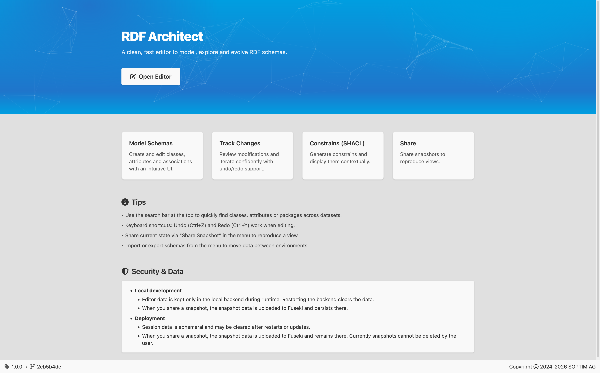
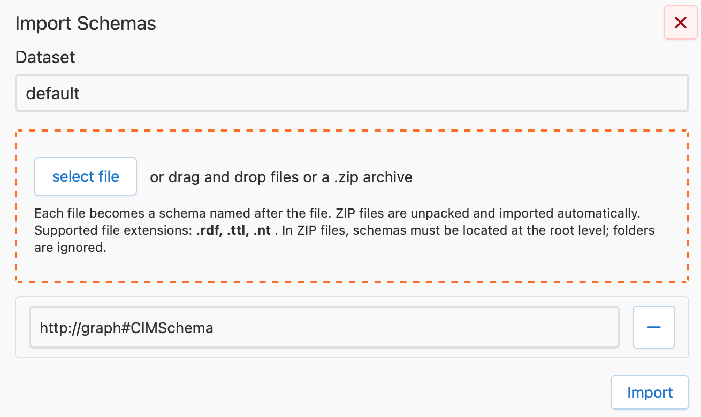
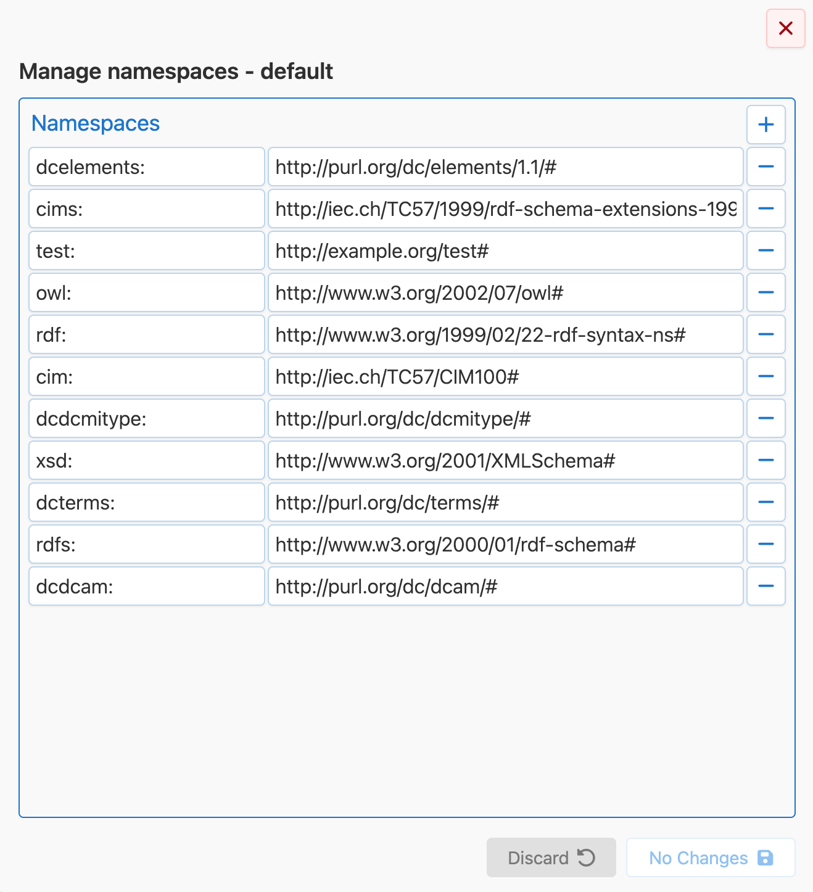
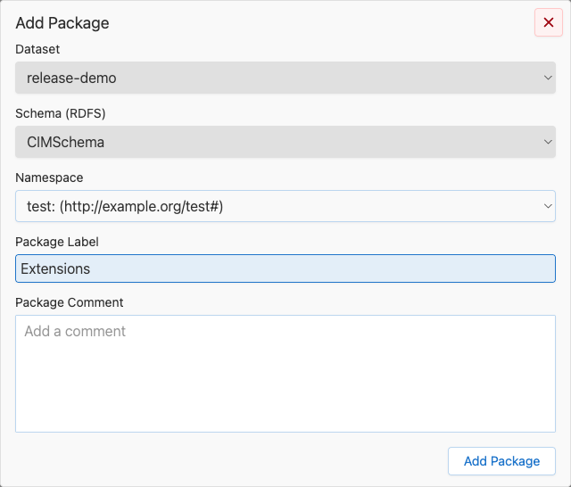
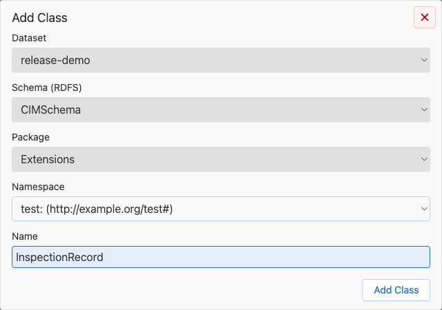
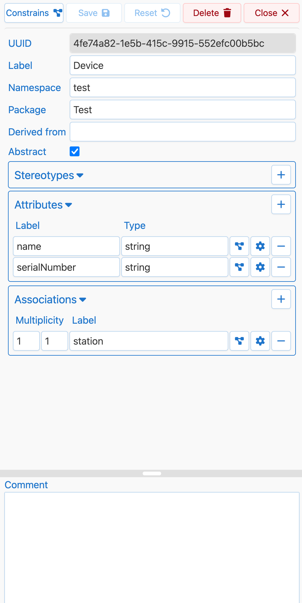
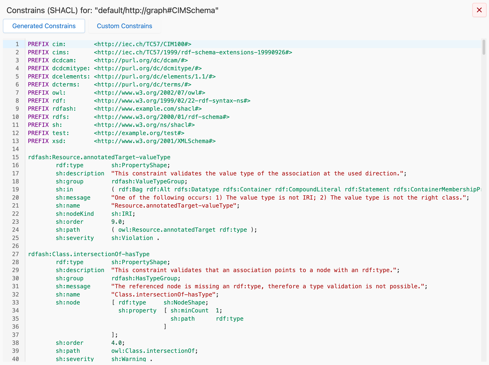
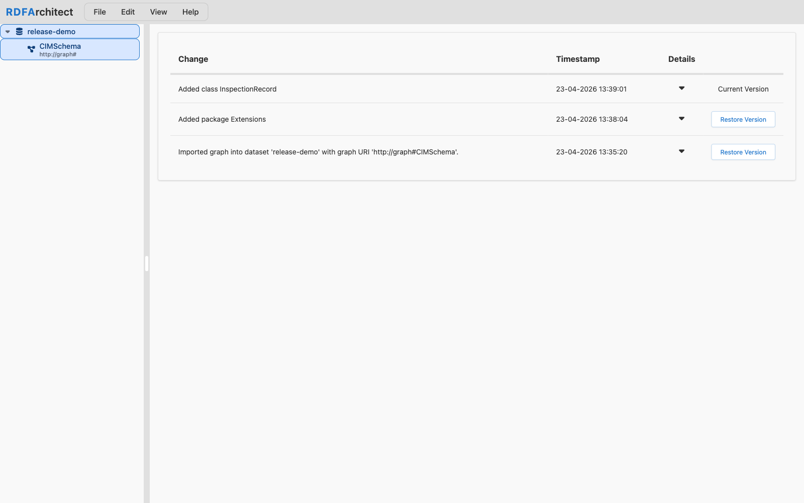
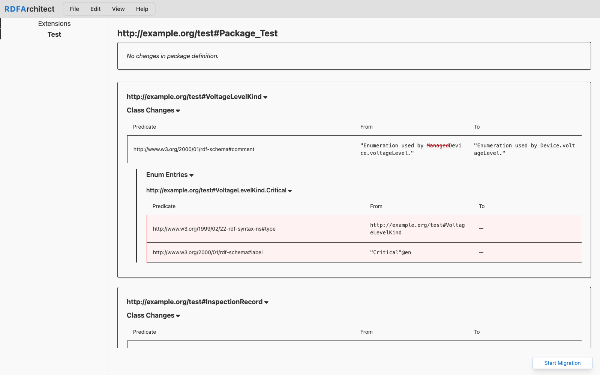
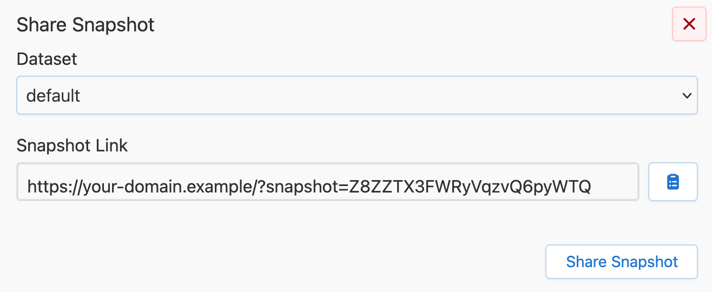

# RDFArchitect Screenshots

This page is a visual overview of the editor and the main capabilities it exposes.

## Homepage

## Import and Graph Setup

RDFArchitect imports RDF schema content into datasets and graphs directly from the UI. The import dialog lets users choose the dataset, upload a schema file, and create or target the graph that will be edited afterward.

## Editor Overview

The main editor combines dataset and graph navigation, package-focused diagram rendering, and class-level editing in one workspace. Users can move from imported graphs to packages, classes, and model details without leaving the page.

## Namespace Management

Namespace and prefix handling is available from the dataset context.

## Package Creation

Packages can be created directly inside a graph to structure larger models.
## Class Creation

New classes can be added from the package tree with dataset, graph, namespace, and package context already in place. This keeps model extension fast and consistent with the surrounding schema structure.

## Class Editor

The class editor is the main editing surface for labels, comments, inheritance, package assignment, attributes, associations, and enum content. It is designed to keep structural editing and validation-related actions close to the model element being changed.

## SHACL Inspection

SHACL Constrains can be inspected from the graph context and from class-level dialogs. The UI exposes both generated and custom SHACL views and makes it clear when no SHACL content is currently available for the selected graph or class.

## Changelog

The changelog view provides visibility into recent graph changes, including additions, updates, and deletions. This helps users review editing history and understand how a model evolved over time.

## Schema Comparison

RDFArchitect compares stored and uploaded schemas directly in the application. The compare view highlights model differences so users can review package-level and class-level changes before migration or release work.

## Snapshots and Export

The sharing and export features support handoff and review workflows. Users can create snapshot links when the backend supports them and export schema or SHACL content from the active graph context.
